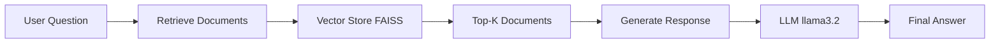

# 🤖 RAG Chatbot with LangGraph & Ollama

<div align="center">


A powerful **Retrieval-Augmented Generation (RAG)** chatbot built with **LangGraph** and **Ollama**. 

Ask questions about Large Language Models and get accurate, context-aware answers powered by Wikipedia knowledge base.

[Features](#-features) • [Installation](#-installation) • [Usage](#-usage) • [Architecture](#-architecture) • [Demo](#-demo)

</div>

---

## ✨ Features

- 🧠 **Intelligent RAG System** - Combines retrieval and generation for accurate answers
- 🔄 **LangGraph Workflow** - Modular, maintainable agent architecture
- 🏠 **Local LLM** - Runs completely offline using Ollama (llama3.2)
- 📚 **Vector Database** - FAISS-powered semantic search
- ⚡ **Fast Embeddings** - Nomic embed-text for quick document retrieval
- 💬 **Interactive CLI** - User-friendly command-line interface
- 🔧 **Fully Configurable** - Easy customization via environment variables
- 📦 **Modular Design** - Clean separation of concerns

## 🏗️ Architecture



### Project Structure

```
langgrap/
├── .env                      # Environment variables (API keys, configs)
├── .gitignore               # Git ignore file
├── README.md                # Project documentation
├── requirements.txt         # Python dependencies
├── main.py                  # Main application entry point
├── config/
│   └── settings.py         # Configuration settings
├── agents/
│   ├── __init__.py
│   ├── rag_agent.py        # RAG agent implementation
│   └── graph.py            # LangGraph workflow definition
├── utils/
│   ├── __init__.py
│   ├── document_loader.py  # Document loading utilities
│   ├── embeddings.py       # Embedding functions
│   └── vector_store.py     # Vector database operations
└── data/
    └── faiss_index/        # FAISS vector store (generated)
```

## 🚀 Installation

### Prerequisites

- Python 3.10 or higher
- [Ollama](https://ollama.ai/) installed and running
- Git

### Steps

1. **Clone the repository**
   ```bash
   git clone https://github.com/m-monirr/-RAG-Chatbot-with-LangGraph.git
   cd -RAG-Chatbot-with-LangGraph
   ```

2. **Create virtual environment**
   ```bash
   python -m venv venv
   source venv/bin/activate  # On Windows: venv\Scripts\activate
   ```

3. **Install dependencies**
   ```bash
   pip install -r requirements.txt
   ```

4. **Set up Ollama**
   ```bash
   # Pull the required models
   ollama pull llama3.2
   ollama pull nomic-embed-text
   ```

5. **Configure environment variables**
   ```bash
   # Create .env file
   cp .env.example .env
   # Edit .env with your configurations
   ```

## 💻 Usage

### Running the Chatbot

```bash
python main.py
```

### Example Interaction

```
🤖 RAG Chatbot: Ask me anything about Large Language Models!
Type 'quit' or 'exit' to end the conversation.

You: What is a transformer model?
🤖: A transformer model is a type of neural network architecture...

You: How does attention mechanism work?
🤖: The attention mechanism allows the model to focus on...
```

## 📝 Configuration

Edit `.env` file to customize:

```env
# LLM Settings
OLLAMA_MODEL=llama3.2
EMBEDDING_MODEL=nomic-embed-text

# Vector Store Settings
VECTOR_STORE_PATH=./data/faiss_index
TOP_K_RESULTS=4

# Document Settings
CHUNK_SIZE=500
CHUNK_OVERLAP=50
```

## 🛠️ Technologies Used

- **LangChain** - Framework for LLM applications
- **LangGraph** - Agent workflow orchestration
- **Ollama** - Local LLM runtime
- **FAISS** - Vector similarity search
- **Python** - Programming language


<div align="center">
Made with ❤️ by m-monirr
</div>
