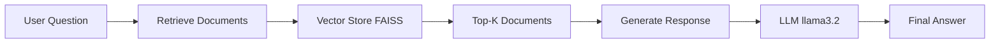

<<<<<<< HEAD
# 🤖 RAG Chatbot with LangGraph & Ollama

A powerful **Retrieval-Augmented Generation (RAG)** chatbot built with **LangGraph** and **Ollama**. 

Ask questions about Large Language Models and get accurate, context-aware answers powered by Wikipedia knowledge base.

[Features](#-features) • [Installation](#-installation) • [Usage](#-usage) • [Architecture](#-architecture) • [Demo](#-demo)

---

## ✨ Features

- 🧠 **Intelligent RAG System** - Combines retrieval and generation for accurate answers
- 🔄 **LangGraph Workflow** - Modular, maintainable agent architecture
- 🏠 **Local LLM** - Runs completely offline using Ollama (llama3.2)
- 📚 **Vector Database** - FAISS-powered semantic search
- ⚡ **Fast Embeddings** - Nomic embed-text for quick document retrieval
- 💬 **Interactive CLI** - User-friendly command-line interface
- 🔧 **Fully Configurable** - Easy customization via environment variables
- 📦 **Modular Design** - Clean separation of concerns

## 🏗️ Architecture

### Project Structure

=======
# -RAG-Chatbot-with-LangGraph
>>>>>>> 8124430b5ee275e6a7574c4edfd4db9bc781fcfe
